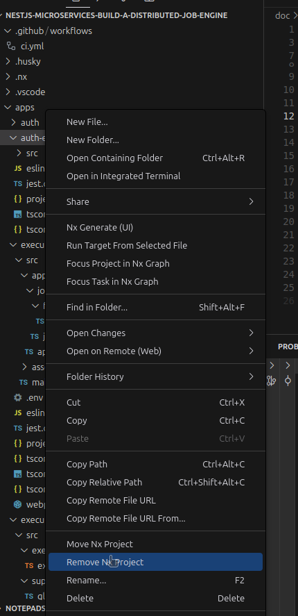
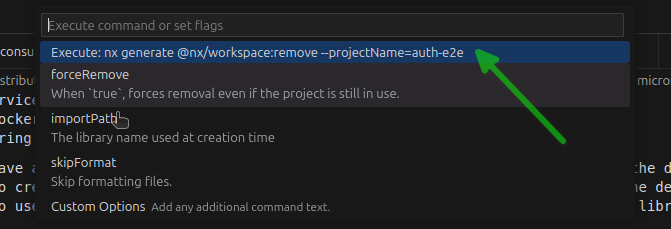

# NestJS Microservices: Build a Distributed Job Engine Udemy Course (Part 5)

## 9. Solution Dockerization

- In this section we are going to dockerize the solution.

### 9.1. Refactoring the microservices and libraries

- Currently we have a single `package.json` file in the root of the project, where we have the dependencies for all the microservices and libraries.
- We are going to create a `package.json` file in the `apps` and `libs` folders to manage the dependencies of each microservice and library.
- We are going to use `workspaces` to manage the dependencies between the microservices and libraries.

#### 9.1.1. Removing the `e2e` tests projects from the `apps` and `libs` folders

- We are going to remove the `e2e` tests projects from the `apps` and `libs` folders.
- We are going to use the `Remove Nx project` option from the `Visual Studio Code` context menu to remove the `e2e` tests projects from the `apps` and `libs` folders.





```bash
 *  Executing task: npx nx generate @nx/workspace:remove --projectName=auth-e2e --no-interactive

 NX  Generating @nx/workspace:remove

DELETE apps/auth-e2e/eslint.config.mjs
DELETE apps/auth-e2e/jest.config.ts
DELETE apps/auth-e2e/project.json
DELETE apps/auth-e2e/src/auth/auth.spec.ts
DELETE apps/auth-e2e/src/auth
DELETE apps/auth-e2e/src/support/global-setup.ts
DELETE apps/auth-e2e/src/support/global-teardown.ts
DELETE apps/auth-e2e/src/support/test-setup.ts
DELETE apps/auth-e2e/src/support
DELETE apps/auth-e2e/src
DELETE apps/auth-e2e/tsconfig.json
DELETE apps/auth-e2e/tsconfig.spec.json
DELETE apps/auth-e2e
 *  Terminal will be reused by tasks, press any key to close it.
juanpabloperez@jpp-PROX15-AMD:~/Training/microservices/nestjs-microservices-build-a-distributed-job-engine/apps$ rm -rf auth/e2e executor/e2e
```

- These are the services that we have after removing the `e2e` tests projects:

> nx.json

```diff
.
-"exclude": [
-  "apps/auth-e2e/**/*",
-  "apps/jobs-e2e/**/*",
-  "apps/executor-e2e/**/*"
-]
.
```

- We need to ensure those projects are removed from the `nx.json` file.

#### 9.1.2. Adding `workspaces` to the root `package.json` file

- We are going to add the `workspaces` property to the root `package.json` file.

```json
.
"workspaces": [
  "apps/*",
  "libs/*"
]
.
```

#### 9.1.3. Adding `package.json` files to the `apps` and `libs` folders

- We are going to add `package.json` files to the `apps` and `libs` folders.

##### 9.1.3.1. Adding `package.json` files to the `apps/auth` folder

- We are going to add a `package.json` file to the `apps/auth` folder.

> apps/auth/package.json

```json
{
  "name": "@jobber/auth",
  "version": "0.0.0",
  "dependencies": {
    "@nestjs/jwt": "^11.0.0",
    "@nestjs/passport": "^11.0.5",
    "bcryptjs": "^3.0.2",
    "passport": "^0.7.0",
    "passport-jwt": "^4.0.1"
  },
  "devDependencies": {
    "@types/bcryptjs": "^2.4.6",
    "@types/passport-jwt": "^4.0.1"
  }
}
```

- We are going to update the `project.json` file to remove the `generate-ts-proto` target.

> apps/auth/project.json

```json
{
  "name": "auth",
  "$schema": "../../node_modules/nx/schemas/project-schema.json",
  "sourceRoot": "apps/auth/src",
  "projectType": "application",
  "tags": [],
  "targets": {
    "build": {
      "executor": "nx:run-commands",
      "options": {
        "command": "webpack-cli build",
        "args": ["node-env=production"]
      },
      "configurations": {
        "development": {
          "args": ["node-env=development"]
        }
      },
      "dependsOn": ["generate-prisma", "^build"]
    },
    "serve": {
      "executor": "@nx/js:node",
      "defaultConfiguration": "development",
      "dependsOn": ["build"],
      "options": {
        "buildTarget": "auth:build",
        "runBuildTargetDependencies": true
      },
      "configurations": {
        "development": {
          "buildTarget": "auth:build:development"
        },
        "production": {
          "buildTarget": "auth:build:production"
        }
      }
    },
    "test": {
      "dependsOn": ["generate-prisma"],
      "options": {
        "passWithNoTests": true
      }
    },
    "generate-prisma": {
      "command": "prisma generate",
      "options": {
        "cwd": "{projectRoot}",
        "input": ["prisma/schema.prisma"]
      },
      "cache": true
    },
    "migrate-prisma": {
      "command": "prisma migrate dev",
      "options": {
        "cwd": "{projectRoot}"
      }
    }
  }
}
```

##### 9.1.3.2. Adding `package.json` files to the `apps/executor` folder

- We are going to add a `package.json` file to the `apps/executor` folder.

> apps/executor/package.json

```json
{
  "name": "@jobber/executor",
  "version": "0.0.0",
  "dependencies": {
    "fibonacci": "^1.6.11"
  },
  "devDependencies": {}
}
```

##### 9.1.3.3. Adding `package.json` files to the `apps/jobs` folder

- We are going to add a `package.json` file to the `apps/jobs` folder.

> apps/jobs/package.json

```json
{
  "name": "@jobber/jobs",
  "version": "0.0.0",
  "dependencies": {
    "graphql-type-json": "^0.3.2"
  },
  "devDependencies": {}
}
```

##### 9.1.3.4. Adding `package.json` files to the `libs/pulsar` folder

- We are going to add a `package.json` file to the `libs/pulsar` folder.

> libs/pulsar/package.json

```json
{
  "name": "@jobber/pulsar",
  "version": "0.0.0",
  "dependencies": {
    "pulsar-client": "^1.13.0"
  },
  "devDependencies": {}
}
```

> Note: We are not going to add a `package.json` file to the `libs/nestjs` folder because doesn't have any dependencies.

#### 9.1.3.5. Removing the not global dependencies from the root `package.json` file

- We are going to remove the not global dependencies from the root `package.json` file.

```json
{
  "name": "@jobber/source",
  "version": "0.0.0",
  "license": "MIT",
  "scripts": {
    "prepare": "husky",
    "generate-ts-proto": "npx protoc --plugin=./node_modules/.bin/ptoroc-gen_ts_proto --ts_proto_out=./types ./proto/*.proto --ts_proto_opt=nestJs=true",
    "serve:all": "nx run-many -t serve -p auth jobs executor",
    "build:all": "nx run-many -t build -p auth jobs executor"
  },
  "workspaces": ["apps/*", "libs/*"],
  "nx": {
    "targets": {
      "generate-ts-proto": {
        "inputs": ["{workspaceRoot}/proto/*.proto"],
        "cacheable": true
      }
    }
  },
  "private": true,
  "dependencies": {
    "@apollo/server": "^4.11.3",
    "@golevelup/nestjs-discovery": "^4.0.3",
    "@grpc/grpc-js": "^1.12.6",
    "@grpc/proto-loader": "^0.7.13",
    "@nestjs/apollo": "^13.0.3",
    "@nestjs/common": "^11.0.11",
    "@nestjs/config": "^4.0.0",
    "@nestjs/core": "^11.0.11",
    "@nestjs/graphql": "^13.0.3",
    "@nestjs/microservices": "^11.0.11",
    "@nestjs/platform-express": "^11.0.11",
    "@prisma/client": "^6.4.1",
    "axios": "^1.8.1",
    "class-transformer": "^0.5.1",
    "class-validator": "^0.14.1",
    "cookie-parser": "^1.4.7",
    "graphql": "^16.10.0",
    "msgpackr": "^1.11.2",
    "reflect-metadata": "^0.2.2",
    "rxjs": "^7.8.2",
    "ts-proto": "^2.6.1"
  },
  "devDependencies": {
    "@angular-devkit/core": "^19.2.0",
    "@eslint/js": "^9.21.0",
    "@nestjs/schematics": "^11.0.1",
    "@nestjs/testing": "^11.0.11",
    "@nx/eslint": "20.4.6",
    "@nx/eslint-plugin": "20.4.6",
    "@nx/jest": "20.4.6",
    "@nx/js": "20.4.6",
    "@nx/nest": "20.4.6",
    "@nx/node": "20.4.6",
    "@nx/web": "20.4.6",
    "@nx/webpack": "20.4.6",
    "@nx/workspace": "20.4.6",
    "@swc-node/register": "~1.10.9",
    "@swc/core": "~1.11.5",
    "@swc/helpers": "~0.5.15",
    "@types/cookie-parser": "^1.4.8",
    "@types/jest": "^29.5.14",
    "@types/node": "~22.13.8",
    "eslint": "^9.21.0",
    "eslint-config-prettier": "^10.0.2",
    "husky": "^9.1.7",
    "jest": "^29.7.0",
    "jest-environment-node": "^29.7.0",
    "lint-staged": "^15.4.3",
    "nx": "20.4.6",
    "prettier": "^3.5.3",
    "prisma": "^6.4.1",
    "ts-jest": "^29.2.6",
    "ts-node": "10.9.2",
    "tslib": "^2.8.1",
    "typescript": "~5.8.2",
    "typescript-eslint": "^8.25.0",
    "webpack-cli": "^6.0.1"
  }
}
```

#### 9.2 Adding new libraries to the project

- We are going to add new libraries to the project.

##### 9.2.1. Adding the `libs/graphql` library

- We are going to rename the `libs/nestjs` library to `libs/graphql` and add the `package.json` file to the project.

> libs/graphql/package.json

```json
{
  "name": "@jobber/graphql",
  "version": "0.0.0",
  "dependencies": {
    "@apollo/server": "^4.11.3",
    "@nestjs/apollo": "^13.0.3",
    "@nestjs/graphql": "^13.0.3",
    "graphql": "^16.10.0"
  },
  "devDependencies": {}
}
```

- We are going to create the `webpack.config.js` file for the `libs/graphql` library.

> libs/graphql/webpack.config.js

```js
const { NxAppWebpackPlugin } = require('@nx/webpack/app-plugin');
const { join } = require('path');

module.exports = {
  output: {
    path: join(__dirname, '../../dist/libs/graphql'),
  },
  plugins: [
    new NxAppWebpackPlugin({
      target: 'node',
      compiler: 'tsc',
      main: './src/index.ts',
      tsConfig: './tsconfig.lib.json',
      optimization: false,
      outputHashing: 'none',
      generatePackageJson: true,
    }),
  ],
};
```

##### 9.2.2. Adding the `libs/nestjs` library

- We are going to create a new library called `libs/nestjs` using the `nx cli` command.

```bash
juanpabloperez@jpp-PROX15-AMD:~/Training/microservices/nestjs-microservices-build-a-distributed-job-engine/libs$ nx generate lib nestjs
✔ Which generator would you like to use? · @nx/nest:library

 NX  Generating @nx/nest:library

✔ Which linter would you like to use? · eslint
✔ Which unit test runner would you like to use? · none
CREATE libs/nestjs/tsconfig.lib.json
CREATE libs/nestjs/tsconfig.json
CREATE libs/nestjs/src/index.ts
CREATE libs/nestjs/README.md
CREATE libs/nestjs/project.json
CREATE eslint.base.config.mjs
UPDATE apps/auth/eslint.config.mjs
UPDATE apps/executor/eslint.config.mjs
UPDATE apps/jobs/eslint.config.mjs
UPDATE libs/graphql/eslint.config.mjs
UPDATE eslint.config.mjs
CREATE libs/nestjs/eslint.config.mjs
UPDATE tsconfig.base.json
CREATE libs/nestjs/src/lib/nestjs.module.ts

 NX   👀 View Details of nestjs

Run "nx show project nestjs" to view details about this project.
```

- We are going to move the `init.ts` file to the `libs/nestjs` library.

> libs/nestjs/src/lib/init.ts

```ts
import { INestApplication, Logger, ValidationPipe } from '@nestjs/common';
import { ConfigService } from '@nestjs/config';
import * as cookieParser from 'cookie-parser';
import * as express from 'express';

export async function init(app: INestApplication) {
  const globalPrefix = 'api';
  app.use(express.json());
  app.useGlobalPipes(
    new ValidationPipe({
      whitelist: true,
    }),
  );
  app.setGlobalPrefix(globalPrefix);
  app.use(cookieParser());
  const port = app.get(ConfigService).getOrThrow('PORT');
  await app.listen(port);
  Logger.log(`🚀 Application is running on: http://localhost:${port}/${globalPrefix}`);
}
```

- We are going to create the `webpack.config.js` file for the `libs/nestjs` library.

> libs/nestjs/webpack.config.js

```js
const { NxAppWebpackPlugin } = require('@nx/webpack/app-plugin');
const { join } = require('path');

module.exports = {
  output: {
    path: join(__dirname, '../../dist/libs/nestjs'),
  },
  plugins: [
    new NxAppWebpackPlugin({
      target: 'node',
      compiler: 'tsc',
      main: './src/index.ts',
      tsConfig: './tsconfig.lib.json',
      optimization: false,
      outputHashing: 'none',
      generatePackageJson: true,
    }),
  ],
};
```

##### 9.2.3. Adding the `libs/grpc` library

- We are going to create a new library called `libs/grpc` using the `nx cli` command.

```bash
juanpabloperez@jpp-PROX15-AMD:~/Training/microservices/nestjs-microservices-build-a-distributed-job-engine/libs$ nx generate lib grpc
✔ Which generator would you like to use? · @nx/nest:library

 NX  Generating @nx/nest:library

✔ Which linter would you like to use? · none
✔ Which unit test runner would you like to use? · none
CREATE libs/grpc/tsconfig.lib.json
CREATE libs/grpc/tsconfig.json
CREATE libs/grpc/src/index.ts
CREATE libs/grpc/README.md
CREATE libs/grpc/project.json
UPDATE tsconfig.base.json
CREATE libs/grpc/src/lib/grpc.module.ts

 NX   👀 View Details of grpc

Run "nx show project grpc" to view details about this project.


 NX   👀 View Details of grpc

Run "nx show project grpc" to view details about this project.
```

- We are going to create the `package.json` file for the `libs/grpc` library.

> libs/grpc/package.json

```json
{
  "name": "@jobber/grpc",
  "version": "0.0.0",
  "dependencies": {
    "ts-proto": "^2.6.1",
    "@grpc/grpc-js": "^1.12.6",
    "@grpc/proto-loader": "^0.7.13"
  },
  "devDependencies": {}
}
```

- We are going to modify the `project.json` file to add the `generate-ts-proto` target.

> libs/grpc/project.json

```json
{
  "name": "grpc",
  "$schema": "../../node_modules/nx/schemas/project-schema.json",
  "sourceRoot": "libs/grpc/src",
  "projectType": "library",
  "tags": [],
  "targets": {
    "build": {
      "dependsOn": ["generate-ts-proto"],
      "options": {
        "assets": [
          {
            "glob": "*.proto",
            "input": "{projectRoot}/src/lib/proto",
            "output": "./proto"
          }
        ]
      }
    },
    "generate-ts-proto": {
      "command": "npx protoc --plugin=protoc-gen-ts_proto=../../node_modules/.bin/protoc-gen-ts_proto --ts_proto_out=./src/lib/types/proto ./src/lib/proto/*.proto --ts_proto_opt=nestJs=true --ts_proto_opt=exportCommonSymbols=false",
      "options": {
        "cwd": "{projectRoot}"
      },
      "inputs": ["{projectRoot}/src/lib/proto/*.proto"],
      "cache": true
    }
  }
}
```

- We are going to create the `webpack.config.js` file for the `libs/grpc` library.

> libs/grpc/webpack.config.js

```js
const { NxAppWebpackPlugin } = require('@nx/webpack/app-plugin');
const { join } = require('path');

module.exports = {
  output: {
    path: join(__dirname, '../../dist/libs/grpc'),
  },
  plugins: [
    new NxAppWebpackPlugin({
      target: 'node',
      compiler: 'tsc',
      main: './src/index.ts',
      tsConfig: './tsconfig.lib.json',
      optimization: false,
      outputHashing: 'none',
      generatePackageJson: true,
    }),
  ],
};
```

- We are going to execute the `nx build grpc` command to build the `libs/grpc` library.

```bash
juanpabloperez@jpp-PROX15-AMD:~/Training/microservices/nestjs-microservices-build-a-distributed-job-engine$ nx build grpc

> nx run grpc:generate-ts-proto

> npx protoc --plugin=protoc-gen-ts_proto=../../node_modules/.bin/protoc-gen-ts_proto --ts_proto_out=./src/lib/types/proto ./src/lib/proto/*.proto --ts_proto_opt=nestJs=true --ts_proto_opt=exportCommonSymbols=false


> nx run grpc:build

> webpack-cli build --node-env=production

chunk (runtime: main) main.js (main) 1.54 KiB [entry] [rendered]
webpack compiled successfully (ee28650bc97d5659)

———————————————————————————————————————————————————————————————————————————————————————————————————————————————————————————————————————————————————————————————

 NX   Successfully ran target build for project grpc and 1 task it depends on (5s)
```

##### 9.2.4. Adding the `libs/prisma` library

- We are going to create a new library called `libs/prisma` using the `nx cli` command.

```bash
juanpabloperez@jpp-PROX15-AMD:~/Training/microservices/nestjs-microservices-build-a-distributed-job-engine/libs$ nx generate lib prisma
✔ Which generator would you like to use? · @nx/nest:library

 NX  Generating @nx/nest:library

✔ Which linter would you like to use? · none
✔ Which unit test runner would you like to use? · none
CREATE libs/prisma/tsconfig.lib.json
CREATE libs/prisma/tsconfig.json
CREATE libs/prisma/src/index.ts
CREATE libs/prisma/README.md
CREATE libs/prisma/project.json
UPDATE tsconfig.base.json
CREATE libs/prisma/src/lib/prisma.module.ts

 NX   👀 View Details of prisma

Run "nx show project prisma" to view details about this project.


 NX   👀 View Details of prisma

Run "nx show project prisma" to view details about this project.
```

- We are going to create the `package.json` file for the `libs/prisma` library.

> libs/prisma/package.json

```json
{
  "name": "@jobber/prisma",
  "version": "0.0.0",
  "dependencies": {
    "@prisma/client": "^6.4.1"
  },
  "devDependencies": {
    "prisma": "^6.4.1"
  }
}
```

- We are going to create the `webpack.config.js` file for the `libs/prisma` library.

> libs/prisma/webpack.config.js

```js
const { NxAppWebpackPlugin } = require('@nx/webpack/app-plugin');
const { join } = require('path');

module.exports = {
  output: {
    path: join(__dirname, '../../dist/libs/prisma'),
  },
  plugins: [
    new NxAppWebpackPlugin({
      target: 'node',
      compiler: 'tsc',
      main: './src/index.ts',
      tsConfig: './tsconfig.lib.json',
      optimization: false,
      outputHashing: 'none',
      generatePackageJson: true,
    }),
  ],
};
```

##### 9.2.5. Adding the `webpack.config.js` file for the `libs/pulsar` library

- We are going to create the `webpack.config.js` file for the `libs/pulsar` library.

> libs/pulsar/webpack.config.js

```js
const { NxAppWebpackPlugin } = require('@nx/webpack/app-plugin');
const { join } = require('path');

module.exports = {
  output: {
    path: join(__dirname, '../../dist/libs/pulsar'),
  },
  plugins: [
    new NxAppWebpackPlugin({
      target: 'node',
      compiler: 'tsc',
      main: './src/index.ts',
      tsConfig: './tsconfig.lib.json',
      optimization: false,
      outputHashing: 'none',
      generatePackageJson: true,
    }),
  ],
};
```
