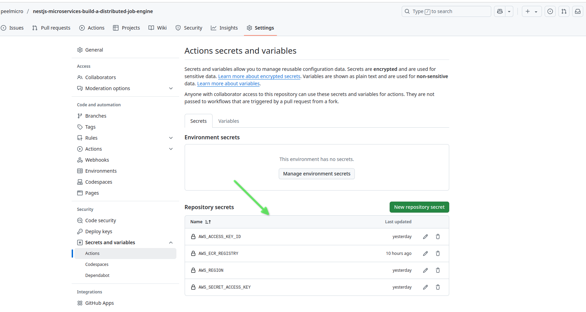

# NestJS Microservices: Build a Distributed Job Engine Udemy Course (Part 7)

## 11. Setting up the Kubernetes

### 11.1. Signing up for ECR (Elastic Container Registry)

- We are going to sign up for ECR to store our Docker images.
- We need to create a new account in AWS and get the credentials.
- We need to log in to the AWS console, then search for ECR and select `Elastic Container Registry`.


- We need to create a new repository by clicking on `Create a repository`.


- We need to give the repository a name, in this case `jobber/jobs`.
- Leave the rest of the defaults and click on `Create`.


- We can see the repository we just created.


- We can see the command to push the image to the repository.


- We are going to create additional repositories for the `executor` and `auth` services.


### 11.2. Setting up the GitHub Actions to build and push the Docker images

#### 11.2.1. Getting the credentials for the AWS ECR repository

- We need to get the credentials for the AWS ECR repository.
- We have to access `Security Credentials` in the AWS console.


- We need to click on `Create access key`.


- We need to click on `Create access key` again.


- We need to copy the `Access key ID` and `Secret access key` and paste them in the secure place.


#### 11.2.2. Setting up the credentials in the GitHub repository

- We need to go to the GitHub repository and click on `Settings`.


- We need to click on the `New repository secret` to add the credentials.


- We need to add the `AWS_ACCESS_KEY_ID` and `AWS_SECRET_ACCESS_KEY` as the secrets.


- We can see the secrets we just added.


- We could also add the `AWS_REGION` as the secret.
- We can get the region from the AWS console.


- We could also add the `AWS_PASSWORD_STDIN` as the secret.
- We can get the password from `View push command` in the ECR repository.


- We can see now of the secrets we have added.



#### 11.2.3. Setting up the GitHub Actions workflow

- We need to update the `ci.yml` workflow file in the `.github/workflows` directory.

> .github/workflows/ci.yml

```yaml
name: CI

on:
  push:
    branches:
      - main
  pull_request:

permissions:
  actions: read
  contents: read

jobs:
  main:
    runs-on: ubuntu-latest
    steps:
      - uses: actions/checkout@v4
        with:
          fetch-depth: 0

      # - run: npm ci --legacy-peer-deps

      # This enables task distribution via Nx Cloud
      # Run this command as early as possible, before dependencies are installed
      # Learn more at https://nx.dev/ci/reference/nx-cloud-cli#npx-nxcloud-startcirun
      # Uncomment this line to enable task distribution
      # - run: npx nx-cloud start-ci-run --distribute-on="3 linux-medium-js" --stop-agents-after="build"

      # Cache node_modules
      - uses: actions/setup-node@v4
        with:
          node-version: 20
          cache: 'npm'

      - name: Setup protoc
        uses: arduino/setup-protoc@v3.0.0

      # - run: npm install -g npm-check-updates
      # - run: ncu -u
      - run: npm ci --legacy-peer-deps

      # This could be not needed, because we are not going to use Nx Cloud
      # - uses: nrwl/nx-set-shas@v4
      #   with:
      #     main-branch-name: main
      #     set-environment-variables-for-job: true
      #     error-on-no-successful-workflow: false

      # Prepend any command with "nx-cloud record --" to record its logs to Nx Cloud
      # - run: npx nx-cloud record -- echo Hello World
      # Nx Affected runs only tasks affected by the changes in this PR/commit. Learn more: https://nx.dev/ci/features/affected
      # - run: npx nx affected -t lint test build # This is not needed, because we are not using Nx Cloud
      - run: npx nx run-many --targets=lint,test,build --all # Run on ALL projects, this is a better approach than nx affected if we don't use Nx Cloud
        env:
          NX_VERBOSE_LOGGING: 'true'

      - name: Configure AWS credentials
        uses: aws-actions/configure-aws-credentials@v3
        with:
          aws-access-key-id: ${{ secrets.AWS_ACCESS_KEY_ID }}
          aws-secret-access-key: ${{ secrets.AWS_SECRET_ACCESS_KEY }}
          aws-region: ${{ secrets.AWS_REGION }}

      - name: Log in to Amazon ECR
        run: |
          aws ecr get-login-password --region ${{ secrets.AWS_REGION }} --password-stdin ${{ secrets.AWS_PASSWORD_STDIN }}

      - name: Build and push all images to ECR
        run: |
          IMAGES=(
            "jobs apps/jobs/Dockerfile"
            "executor apps/executor/Dockerfile"
            "auth apps/auth/Dockerfile"
          )

          for image in "${IMAGES[@]}"; do
            NAME=$(echo $image | cut -d' ' -f1)
            DOCKERFILE=$(echo $image | cut -d' ' -f2)

            {
              docker build \
                --tag ${{ secrets.AWS_PASSWORD_STDIN }}/jobber/$NAME:latest \
                -f $DOCKERFILE \
                . && docker push ${{ secrets.AWS_PASSWORD_STDIN }}/jobber/$NAME:latest
            } &
          done

          wait
```

#### 11.2.4. Adding the .dockerignore file

- We need to add the `.dockerignore` file to the root of the project.

> .dockerignore

```text
node_modules
dist
```

#### 11.2.5. We need to ensure that the Docker build is successful
